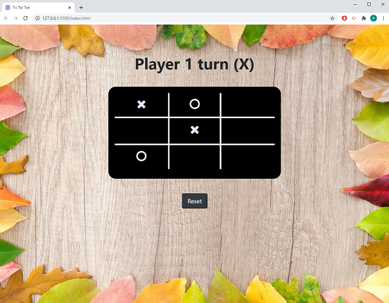

# Tic-Tac-Toe_v2.0

## Description 

This is a different version of Jeu_Du_Morpion_v1.0. The goal is still to build a simple tic-tac-toe using a Bootstrap however the table is replaced by simple col and row with full responsiveness. 
Here are the other criterias required for this story:    
 - Each player alternates.    
 - Selecting a cell already filled with a cross or a nought is not permitted.  
 - When 3 crosses or 3 noughts are aligned, the cells background turns in green.  
 - When someone wins, the next click restarts the game.    

App's URL: [link]

## Preview :mag:

  

## Credits
 
Icons made by Freepik from [www.flaticon.com](https://www.flaticon.com/)

## License
The MIT License (MIT)

Copyright (c) 2021 DT.

Permission is hereby granted, free of charge, to any person obtaining a copy of this software and associated documentation files (the "Software"), to deal in the Software without restriction, including without limitation the rights to use, copy, modify, merge, publish, distribute, sublicense, and/or sell copies of the Software, and to permit persons to whom the Software is furnished to do so, subject to the following conditions:  

The above copyright notice and this permission notice shall be included in all copies or substantial portions of the Software.  

THE SOFTWARE IS PROVIDED "AS IS", WITHOUT WARRANTY OF ANY KIND, EXPRESS OR IMPLIED, INCLUDING BUT NOT LIMITED TO THE WARRANTIES OF MERCHANTABILITY, FITNESS FOR A PARTICULAR PURPOSE AND NONINFRINGEMENT. IN NO EVENT SHALL THE AUTHORS OR COPYRIGHT HOLDERS BE LIABLE FOR ANY CLAIM, DAMAGES OR OTHER LIABILITY, WHETHER IN AN ACTION OF CONTRACT, TORT OR OTHERWISE, ARISING FROM, OUT OF OR IN
CONNECTION WITH THE SOFTWARE OR THE USE OR OTHER DEALINGS IN THE SOFTWARE.  

---
[link]: https://delph-sunny.github.io/Tic-Tac-Toe_v2.0/
